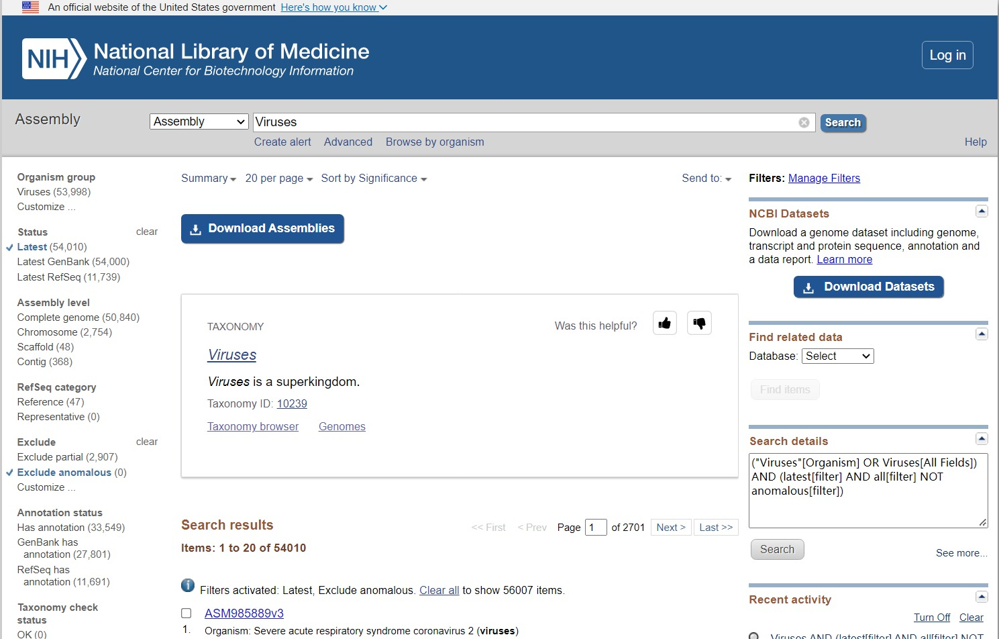
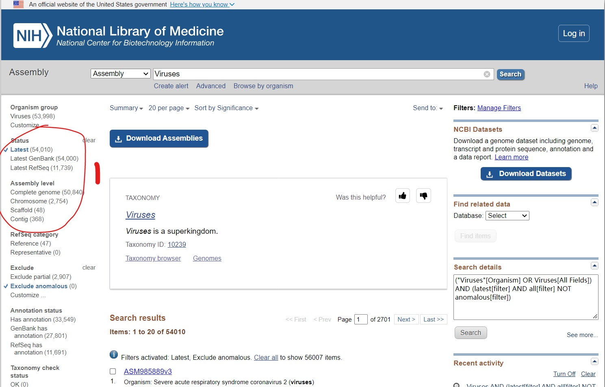
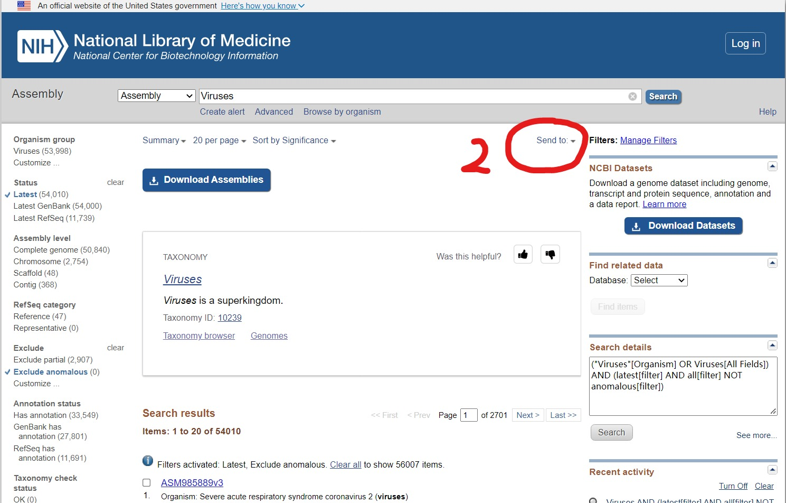
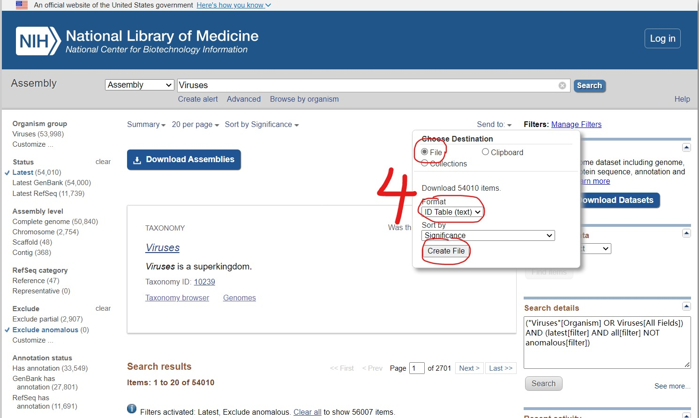
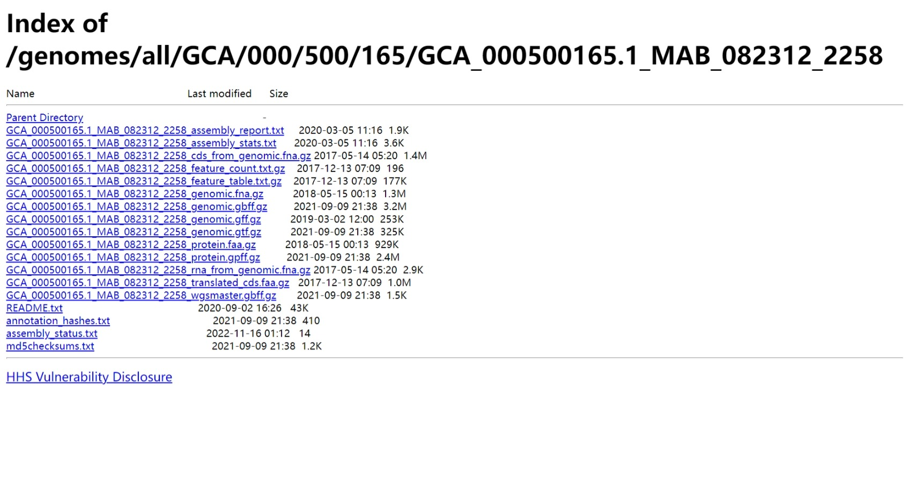

# NCBI_Genome_Data_Download

该脚本便于从 NCBI 上批量下载基因组数据，由于大家需求不同，该脚本只是下载了每一个物种基因组中的核酸序列(.fna)以及基因组注释信息(.gbff)，需要下载其他文件可自行修改脚本。

## 用法/示例
```bash
bash download.sh $1 $2 $3
#$1：IDtable.txt
#$2: Output file folder name
#$3: Database (GenBank--GB, Refseq--Ref)
```
```bash
#Example
bash download.sh IDtable.txt Test Ref
```
## 流程
### 1.预处理：从 NCBI 上下载得到 IDtable 文件
- 进入NCBI Assembly 网站 (https://www.ncbi.nlm.nih.gov/assembly/) 搜索需要批量下载的物种名称 (e.g. Escherichia coli，Viruses)


- 选择左侧 **Status** 以及 **Assembly level** 选中数据范围


- 点击中央上方**Send to**，勾选 **file**，**ID Table (text)**，点击 **Create File** 下载文件得到IDtable.txt(**建议：修改下载的文件名称**)



- 检查下载的数据(NA 表示没有对应的数据)

GenBank Assembly ID (Accession.version)	|GenBank release ID	|RefSeq Assembly ID (Accession.version)|RefSeq release ID
--|--|--|--| 	
GCA_000500165.1	|863668	|GCF_000500165.1	|863898
GCA_000500185.1	|863688	|GCF_000500185.1	|864078
GCA_000523875.1	|897338	|N/A	|N/A	
GCA_000280655.1	|401628	|GCF_000280655.1	|621018	

### 2.使用download.sh下载数据
```bash
bash download.sh IDtable.txt Test Ref
```
该脚本以**IDtable.txt**中的**Assembly ID**为输入对象(GCA_000500165.1)，采用 rsync 工具批量下载 NCBI FTP(https://ftp.ncbi.nlm.nih.gov/genomes/all/GCA/000/500/165/GCA_000500165.1_MAB_082312_2258/) 上对应的氨基酸序列(_genomic.fna.gz)以及基因组注释文件(_genomic.gbff.gz)



## 自定义下载内容
可修改 *NCBIGenomeDownload.py* 文件中第55-65行。
其中第55-59为一个下载单元
```python
# replace postfix  "_genomic.fna.gz"   for what you want to download
# You can get a reference to the suffix format from the following website:
# https://ftp.ncbi.nlm.nih.gov/genomes/all/GCA/000/500/165/GCA_000500165.1_MAB_082312_2258/
fnafile = x[:-1] + "_genomic.fna.gz"
fnaUrl_https = TestUrl + x + fnafile
fnaUrl_rsync = fnaUrl_https.replace("https","rsync")
f.write(fnaUrl_rsync)
f.write('\n')
```
